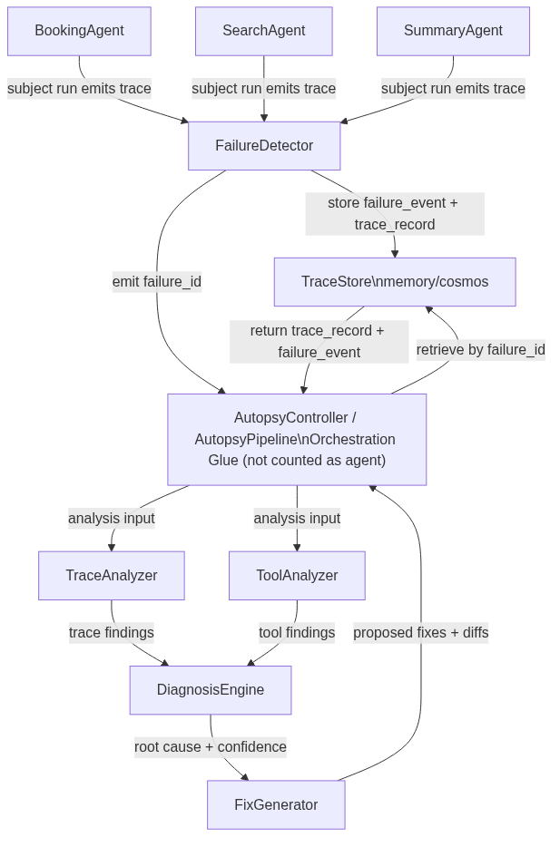

# Indagine

[](LICENSE)

Indagine is a meta-agent system for debugging other AI agents when they fail.

Given a failure event, Indagine analyzes trace + tool behavior, classifies the root cause using a shared taxonomy, and proposes concrete fixes (including unified diffs).

<!-- top-readme: begin -->
## API / CLI reference

- [demo/run_demo.py](demo/run_demo.py)
- [src/subjects/run_subjects.py](src/subjects/run_subjects.py)
- [src/scripts/verify_foundry.py](src/scripts/verify_foundry.py)
- [src/scripts/run_and_capture.py](src/scripts/run_and_capture.py)

## Support / Community

- [docs/](docs/)

## Security

## Changelog / Releases

- [pyproject.toml](pyproject.toml)

## Roadmap

- [TODO.md](TODO.md)
<!-- top-readme: end -->

## What you get

- Deterministic "subject" agents that fail predictably for repeatable debugging
- Structured analyzers (trace + tool/schema) that produce machine-readable findings
- Diagnosis engine with an explicit failure taxonomy
- Fix proposal generation designed for human review (diff-first)
- Optional Azure integrations (Foundry, Cosmos, Azure Monitor) without making them mandatory

## Demo (2 minutes)

Fixture-backed (always works):

```bash
uv run python demo/run_demo.py --mode mock
```

Live run (runs the pipeline end-to-end against the deterministic subjects):

```bash
uv run python demo/run_demo.py --mode live --subject booking --store memory
```

The demo prints:

- `failure_event` (what failed)
- `findings` (trace + tool/schema analysis)
- `diagnosis` (taxonomy classification + confidence)
- `fixes` (proposed changes + unified diff)

## Installation

Prereqs:

- Python 3.11+
- `uv`

```bash
uv sync
```

## Quick start

Run a deterministic failure subject directly:

```bash
uv run python -m src.subjects.run_subjects booking
```

Run the tests:

```bash
uv run pytest -q
```

## How it works

Indagine is organized as a simple pipeline:

1. A deterministic subject agent fails (predictably)
2. `FailureDetector` captures a failure event and trace record
3. Analyzers produce structured findings:
   - Trace analysis: where the failure happened + reasoning chain
   - Tool analysis: schema mismatches / tool misuse signals
4. `DiagnosisEngine` maps findings onto a shared failure taxonomy
5. `FixGenerator` emits fix proposals (including diffs) for review

Architecture diagram:



Key artifacts:

- `docs/failure_taxonomy.md` (shared diagnosis vocabulary)
- `docs/architecture.mmd` (diagram source)

## Project layout

- `src/subjects/` deterministic agents that fail in known ways
- `src/analyzers/` trace + tool analyzers that emit structured findings
- `src/core/` pipeline orchestration, diagnosis, fix generation, tracing
- `src/storage/` in-memory and Cosmos backends
- `demo/` 2-minute demo script + fixture output
- `docs/` architecture diagram + failure taxonomy

## Configuration (optional)

Create `.env` from `.env.example` if you want Foundry/Azure Monitor verification.

Foundry reachability (optional):

- `FOUNDRY_PROJECT_ENDPOINT`
- `FOUNDRY_MODEL_DEPLOYMENT`

Tracing export (optional):

- `APPLICATIONINSIGHTS_CONNECTION_STRING`

Cosmos storage (optional):

- `COSMOS_ENDPOINT`
- `COSMOS_KEY`
- `COSMOS_DATABASE`
- `COSMOS_CONTAINER_TRACES`
- `COSMOS_CONTAINER_FIXES`

Note: environment variables take precedence over `infra/foundry_config.yaml`.

## Verification

```bash
uv run pytest -q
```

Optional (Foundry reachability):

```bash
uv run python -m src.scripts.verify_foundry --strict
```

Optional (Cosmos trace capture roundtrip):

```bash
uv run python -m src.scripts.run_and_capture --store cosmos
```

## Development

Lint:

```bash
uv run ruff check .
```

## Contributing

Issues and pull requests are welcome.

## License

Apache-2.0 (see `LICENSE`).
