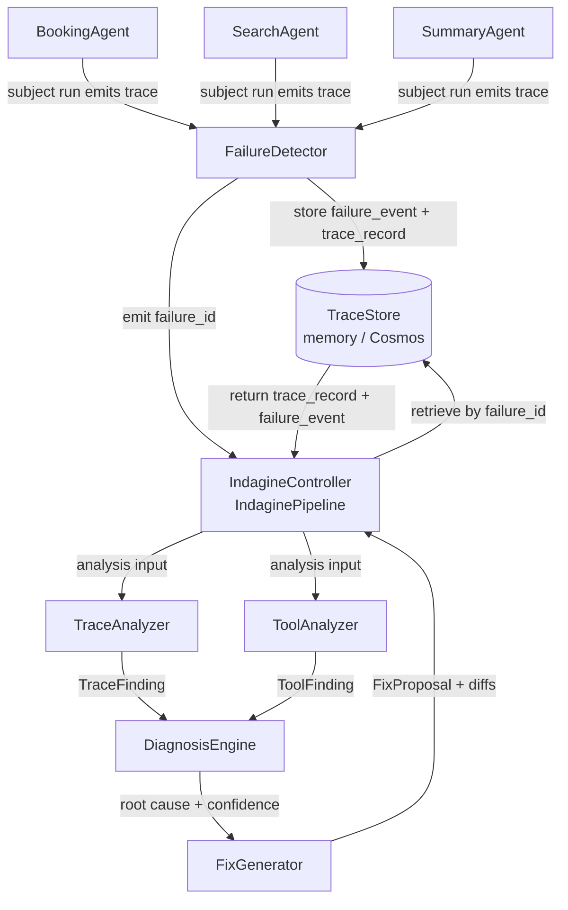

<picture>
  <source media="(prefers-color-scheme: dark)" srcset="docs/brand/logo-horizontal-dark.svg">
  
</picture>

# Indagine

**When an AI agent breaks, Indagine investigates why.**

Derived from the Italian word for *"investigation"* or *"inquiry"*, **Indagine** acts as a forensic specialist for your multi-agent systems, treating agent failures as evidence to be systematically analyzed.

[](LICENSE)
[](pyproject.toml)
[](https://github.com/astral-sh/uv)

Indagine is a **meta-agent system for debugging other AI agents when they fail**. It captures execution traces, runs parallel analysis passes, classifies the root cause against a six-category failure taxonomy, and emits concrete diff-first fix proposals, all without requiring a live LLM.

---

## How It Works

```
┌──────────────────────────────────────────────────────────────────────────────┐
│                              Indagine Pipeline                               │
│                                                                              │
│   ┌──────────────┐                                                           │
│   │ booking_agent│──┐                                                        │
│   │ search_agent │  │  FailureDetector        TraceStore                     │
│   │ summary_agent│──┴──► (wrap + run) ──────► (memory / Cosmos)              │
│   └──────────────┘        captures OTel                 │                    │
│        subject agents      trace + emits                 │ retrieve by       │
│   (deterministic failures) failure_event                 │ failure_id        │
│                                                          ▼                   │
│                                          ┌───────────────────────────┐       │
│                                          │    IndagineController     │       │
│                                          │ (sequential or parallel)  │       │
│                                          └────────┬──────────────────┘       │
│                                                   │                          │
│                              ┌────────────────────┼────────────────────┐     │
│                              ▼                                         ▼     │
│                      ┌──────────────┐                         ┌────────────┐ │
│                      │ TraceAnalyzer│                         │ToolAnalyzer│ │
│                      │  step flow,  │                         │ schema     │ │
│                      │  errors,     │                         │ mismatches,│ │
│                      │  reasoning   │                         │ wrong tool │ │
│                      └──────┬───────┘                         └─────┬──────┘ │
│                             │     TraceFinding + ToolFinding         │       │
│                             └──────────────┬─────────────────────────┘       │
│                                            ▼                                 │
│                                  ┌─────────────────┐                         │
│                                  │ DiagnosisEngine │  deterministic          │
│                                  │  classify root  │  rule-based +           │
│                                  │  cause + subtype│  optional Foundry       │
│                                  └────────┬────────┘  GPT-4o                 │
│                                           │ Diagnosis                        │
│                                           ▼                                  │
│                                  ┌─────────────────┐                         │
│                                  │  FixGenerator   │  FixProposal with       │
│                                  │  diff patches   │  unified diff patch     │
│                                  └─────────────────┘                         │
└──────────────────────────────────────────────────────────────────────────────┘
```

1. **A failing subject agent runs** - `booking_agent`, `search_agent`, or `summary_agent` executes a deterministic scenario that fails in a known way.
2. **FailureDetector wraps the run** - catches exceptions, timeouts, validation errors, and hallucination flags; wraps results in an OpenTelemetry span; emits a `FailureEvent` + `TraceRecord`.
3. **TraceStore persists the trace** - stores `failure_event` + `trace_record` by `failure_id` (in-memory default, Cosmos DB optional).
4. **IndagineController dispatches analyzers** - runs `TraceAnalyzer` and `ToolAnalyzer` sequentially or in parallel (thread pool), collecting a unified `FindingsReport`.
5. **DiagnosisEngine classifies** - maps findings to one of six failure categories using a deterministic rule engine. Azure AI Foundry / GPT-4o is optionally consulted for richer LLM-backed explanations.
6. **FixGenerator proposes fixes** - emits `FixProposal` objects with `title`, `rationale`, and a `diff` patch per changed file, ready to apply or review.

---

## Failure Taxonomy

Indagine classifies every failure into exactly one of six categories defined in [`docs/failure_taxonomy.md`](docs/failure_taxonomy.md):

| # | Category | Symptoms | Detection Signals | Typical Fixes |
|---|----------|----------|-------------------|---------------|
| 1 | **PROMPT_AMBIGUITY** | Instructions interpreted multiple ways; behavior varies across similar inputs | Ambiguous language, missing constraints or examples, unclear intent | Add explicit constraints and examples; restate expected output format |
| 2 | **TOOL_MISUSE** | Wrong tool selected, invalid parameters, or schema/format errors during tool calls | Tool schema validation errors; mismatch between intended and invoked tool | Add pre-call validation/transformation; tighten tool-selection rules |
| 3 | **HALLUCINATION** | Agent returns confident claims not supported by trace, tools, or provided sources | Missing source attribution; statements not grounded in retrieved data | Require source-backed outputs; add guardrails that reject ungrounded claims |
| 4 | **CONTEXT_OVERFLOW** | Agent forgets earlier constraints or drops critical context mid-flow | Long traces with lost instructions; outputs ignoring earlier required details | Summarize and pin critical context; reduce prompt/token footprint before key steps |
| 5 | **REASONING_ERROR** | Agent has relevant data but reaches incorrect conclusions or skips logical steps | Inconsistent reasoning chain between evidence and final output | Enforce stepwise reasoning checks; add intermediate validation before final answer |
| 6 | **COORDINATION_FAILURE** | Handoff between agents breaks; shared state lost or sequence incorrect | Missing/invalid handoff payloads; timeout patterns; inconsistent cross-agent state | Standardize handoff contracts; add retry/idempotency and state validation at boundaries |

---

## Quickstart

**Prerequisites:** Python 3.11+, [`uv`](https://github.com/astral-sh/uv)

```bash
git clone https://github.com/Microck/indagine.git
cd indagine
uv sync

# Run the demo against a pre-recorded fixture (no Azure credentials required)
uv run python demo/run_demo.py --mode mock
```

This prints a full JSON report (`findings`, `diagnosis`, and `fixes`) derived from the bundled `demo/sample_output.md` fixture.

---

## Installation

```bash
uv sync
```

Azure AI Foundry and Azure Monitor integration are already included in the dependency list (`azure-ai-projects`, `azure-monitor-opentelemetry`, `azure-identity`). No additional install step is needed; both integrations activate automatically when the relevant environment variables are set.

---

## Usage

### Run a subject agent scenario

```bash
uv run python -m src.subjects.run_subjects booking
uv run python -m src.subjects.run_subjects search
uv run python -m src.subjects.run_subjects summary
```

Each subject prints a JSON result to stdout. `booking` and `search` trigger `TOOL_MISUSE` failures; `summary` triggers a `HALLUCINATION`.

### Run the end-to-end demo

```bash
# Live - runs the full pipeline and prints the diagnosis + fixes
uv run python demo/run_demo.py --mode live --subject booking --store memory

# Mock - uses the bundled fixture (no credentials required)
uv run python demo/run_demo.py --mode mock
```

**CLI flags:**

| Flag | Values | Default | Description |
|------|--------|---------|-------------|
| `--mode` | `mock`, `live` | `mock` | Use pre-recorded fixture or live pipeline |
| `--subject` | `booking`, `search`, `summary` | `booking` | Which subject agent to run |
| `--store` | `memory`, `cosmos` | `memory` | Trace store backend |
| `--timeout-s` | float | `5.0` | Execution timeout for the subject agent |

### Capture traces for all subjects

```bash
uv run python -m src.scripts.run_and_capture --store memory
```

Runs all three subject agents, stores their traces, and prints a JSON summary line per subject.

---

## Configuration

Indagine works out of the box without any Azure credentials. All LLM and tracing integrations are optional.

```bash
cp .env.example .env
# Fill in the values you need
```

| Variable | Required | Description |
|----------|----------|-------------|
| `FOUNDRY_PROJECT_ENDPOINT` | Optional | Azure AI Foundry project endpoint URL - enables GPT-4o-backed diagnosis |
| `FOUNDRY_MODEL_DEPLOYMENT` | Optional | Model deployment name as shown in Foundry "Models + endpoints" |
| `APPLICATIONINSIGHTS_CONNECTION_STRING` | Optional | Azure Monitor connection string - enables cloud trace export; falls back to console |

Authentication uses `DefaultAzureCredential`. Without `az login`, set `AZURE_TENANT_ID`, `AZURE_CLIENT_ID`, and `AZURE_CLIENT_SECRET` in your environment.

Config is loaded from environment variables first; `infra/foundry_config.yaml` is used as a non-secret fallback for endpoint and deployment defaults.

### Verify Foundry connectivity

```bash
# Print config and tracing status without making a live network call
uv run python -m src.scripts.verify_foundry

# Exit non-zero when config is missing or live check fails
uv run python -m src.scripts.verify_foundry --strict
```

---

## Subject Agents

Three purpose-built demonstrators fail in deterministic, reproducible ways:

| Agent | Module | Injected Failure | Root Cause Category |
|-------|--------|------------------|---------------------|
| **booking_agent** | `src/subjects/booking_agent.py` | Date passed as `DD/MM/YYYY` to a tool requiring `YYYY-MM-DD` | `TOOL_MISUSE` → `schema_mismatch` |
| **search_agent** | `src/subjects/search_agent.py` | Calls `summarize_sources` on an empty list from a vague instruction | `TOOL_MISUSE` → `wrong_tool_selection` |
| **summary_agent** | `src/subjects/summary_agent.py` | Returns a hallucinated claim not supported by any provided source | `HALLUCINATION` → `hallucinated_metadata` |

Each subject can be run standalone or wired through the full Indagine pipeline via `IndaginePipeline.run(failure_id)`.

---

## Project Layout

```
indagine/
├── demo/
│   ├── run_demo.py          # End-to-end demo runner (mock + live modes)
│   ├── sample_output.md     # Pre-recorded fixture used by --mode mock
│   └── voiceover.md         # Narration script for the recorded demo
├── docs/
│   ├── brand/               # Logo SVGs (light + dark)
│   ├── architecture.mmd     # Mermaid source for the architecture diagram
│   ├── architecture.png     # Rendered architecture diagram
│   └── failure_taxonomy.md  # Canonical six-category failure taxonomy
├── infra/
│   └── foundry_config.yaml  # Non-secret Foundry defaults (overridden by env)
├── src/
│   ├── analyzers/
│   │   ├── trace_analyzer.py  # Step-level trace analysis → TraceFinding
│   │   └── tool_analyzer.py   # Schema validation + wrong-tool detection → ToolFinding
│   ├── core/
│   │   ├── diagnosis_engine.py    # Classifies FindingsReport → Diagnosis
│   │   ├── diff_utils.py          # Unified diff helpers for fix proposals
│   │   ├── failure_detector.py    # Wraps subject runs; emits FailureEvent + TraceRecord
│   │   ├── fix_generator.py       # Maps Diagnosis → FixProposal list with diffs
│   │   ├── foundry_client.py      # Azure AI Foundry / AIProjectClient factory
│   │   ├── indagine_controller.py # Dispatches analyzers (sequential or parallel)
│   │   ├── indagine_pipeline.py   # Pipeline entry point: failure_id → FindingsReport
│   │   └── tracing.py             # OpenTelemetry setup (Azure Monitor or console)
│   ├── models/
│   │   ├── diagnosis.py    # Diagnosis, FailureTaxonomy enum
│   │   ├── failure.py      # FailureEvent, FailureType
│   │   ├── findings.py     # FindingsReport, TraceFinding, ToolFinding
│   │   ├── fixes.py        # FixProposal, FixChange, FixType
│   │   ├── trace.py        # TraceRecord, TraceStep, TraceToolCall (analyzer input)
│   │   └── trace_record.py # TraceRecord variant used by failure_detector
│   ├── scripts/
│   │   ├── run_and_capture.py  # Batch-run all subjects and persist traces
│   │   └── verify_foundry.py   # Foundry connectivity + tracing verification
│   ├── storage/
│   │   ├── cosmos_client.py       # Azure Cosmos DB client factory
│   │   ├── fix_history.py         # Fix history interface
│   │   ├── fix_history_memory.py  # In-memory fix history (similarity lookup)
│   │   └── trace_store.py         # TraceStore with memory / cosmos backends
│   ├── subjects/
│   │   ├── booking_agent.py  # TOOL_MISUSE subject (date format mismatch)
│   │   ├── run_subjects.py   # CLI runner for individual subjects
│   │   ├── search_agent.py   # TOOL_MISUSE subject (wrong tool + empty sources)
│   │   └── summary_agent.py  # HALLUCINATION subject (unsupported claim)
│   └── tools/
│       ├── registry.py        # ToolRegistry + ToolValidationError
│       ├── schema_registry.py # JSON Schema registry for registered tools
│       └── schemas/           # JSON Schema files per tool
├── tests/                     # pytest test suite (unit + smoke)
├── .env.example               # Environment variable template
├── pyproject.toml             # Project metadata, dependencies, ruff + pytest config
└── uv.lock                    # Locked dependency graph
```

---

## Architecture


```mermaid
flowchart TD
    BA[BookingAgent]
    SEA[SearchAgent]
    SUM[SummaryAgent]
    FD[FailureDetector]
    TS[(TraceStore<br>memory / Cosmos)]
    AP[IndagineController<br>IndaginePipeline]
    TRA[TraceAnalyzer]
    TOA[ToolAnalyzer]
    DE[DiagnosisEngine]
    FG[FixGenerator]

    BA -->|subject run emits trace| FD
    SEA -->|subject run emits trace| FD
    SUM -->|subject run emits trace| FD

    FD -->|store failure_event + trace_record| TS
    FD -->|emit failure_id| AP
    AP -->|retrieve by failure_id| TS
    TS -->|return trace_record + failure_event| AP

    AP -->|analysis input| TRA
    AP -->|analysis input| TOA
    TRA -->|TraceFinding| DE
    TOA -->|ToolFinding| DE

    DE -->|root cause + confidence| FG
    FG -->|FixProposal + diffs| AP
```

---

## Development

**Lint:**

```bash
uv run ruff check .
```

**Auto-fix lint issues:**

```bash
uv run ruff check --fix .
```

**Format:**

```bash
uv run ruff format .
```

Ruff targets Python 3.11+, line length 100, with `E` and `F` rule sets (see `pyproject.toml`).

---

## Testing

```bash
uv run pytest -q
```

The test suite covers:

| Test file | What it covers |
|-----------|---------------|
| `test_trace_analyzer.py` | Step-level failure detection and reasoning chain extraction |
| `test_tool_analyzer.py` | Schema validation mismatches and wrong-tool detection |
| `test_diagnosis_engine.py` | Classification for all six taxonomy categories |
| `test_fix_generator.py` | Fix proposal generation per root cause |
| `test_indagine_controller.py` | Sequential and parallel analyzer dispatch |
| `test_trace_store_memory.py` | In-memory store round-trip |
| `test_fix_history_memory.py` | In-memory fix history similarity lookup |
| `test_subject_failures.py` | Deterministic failure scenarios per subject agent |
| `test_demo_runner.py` | Mock fixture load plus live booking pipeline smoke coverage |
| `test_smoke.py` | Import smoke coverage for core tracing setup |

No mocks are used. All tests rely on real implementations and in-memory fakes.

---

## Contributing

Issues and pull requests are welcome.

1. Fork the repository and create a feature branch.
2. Install dependencies with `uv sync`.
3. Run `uv run ruff check .` and `uv run pytest -q` before opening a PR.
4. Keep commits focused; describe the _why_ in the commit message.

For bug reports, include the subject agent name, the failure output JSON, and the diagnosis result if available.

---

## License

Apache-2.0. See [`LICENSE`](LICENSE).

---

## Origin

Built for the **Microsoft AI Dev Days Hackathon 2026**.

Indagine was designed to answer a recurring question in multi-agent systems: when an agent fails, how do you go from "something went wrong" to "here is the exact change that fixes it"? The answer is a meta-agent that treats agent failures the same way a forensic investigator treats evidence: systematically, without guessing.
